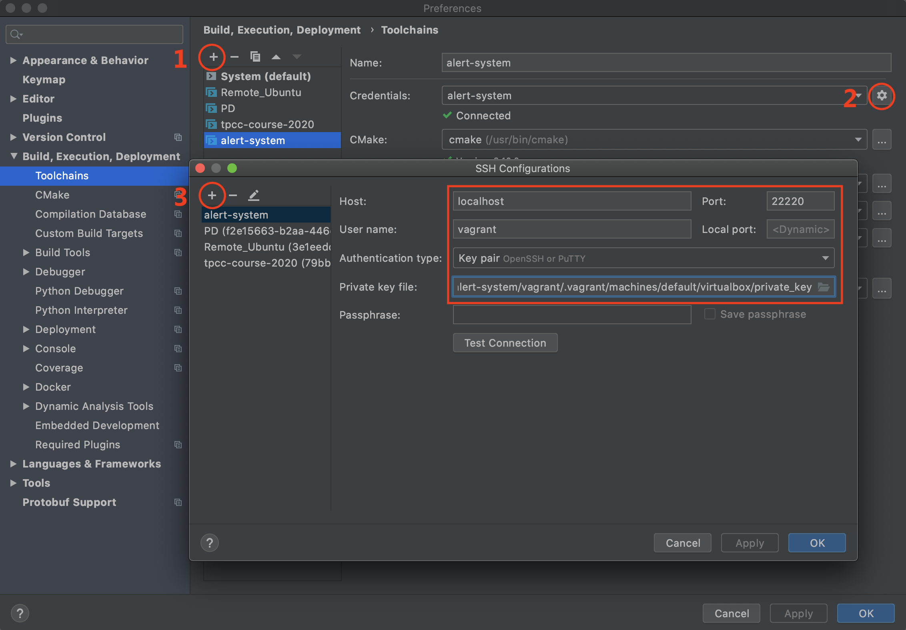
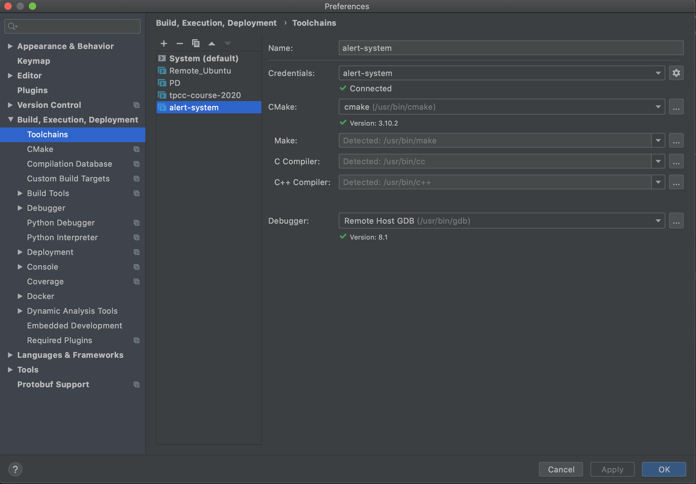
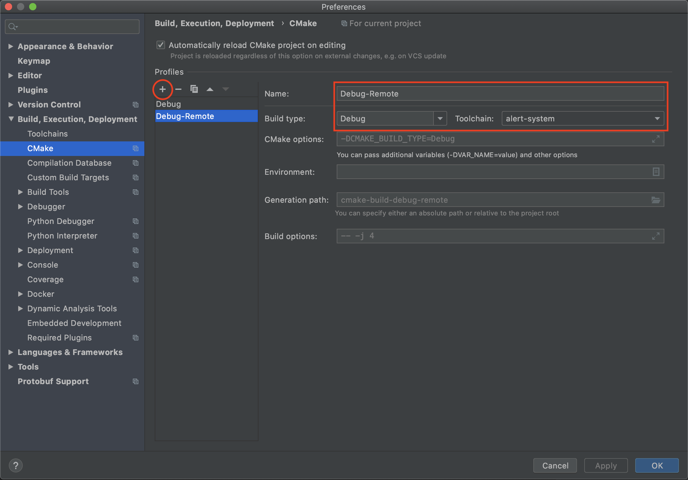
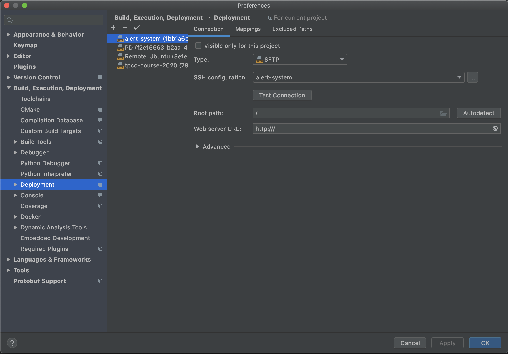
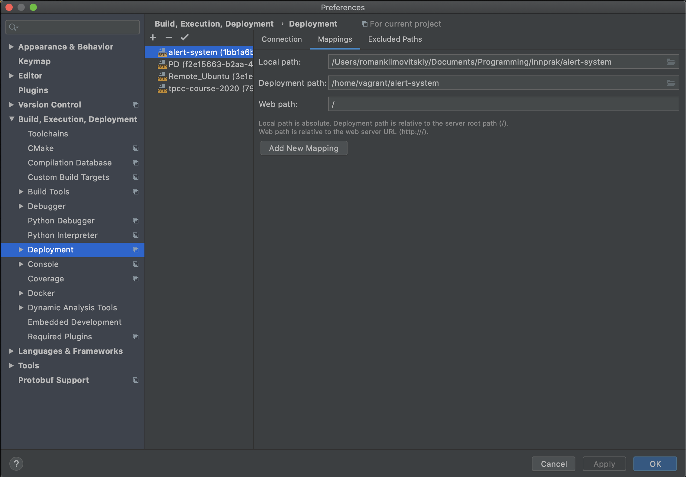
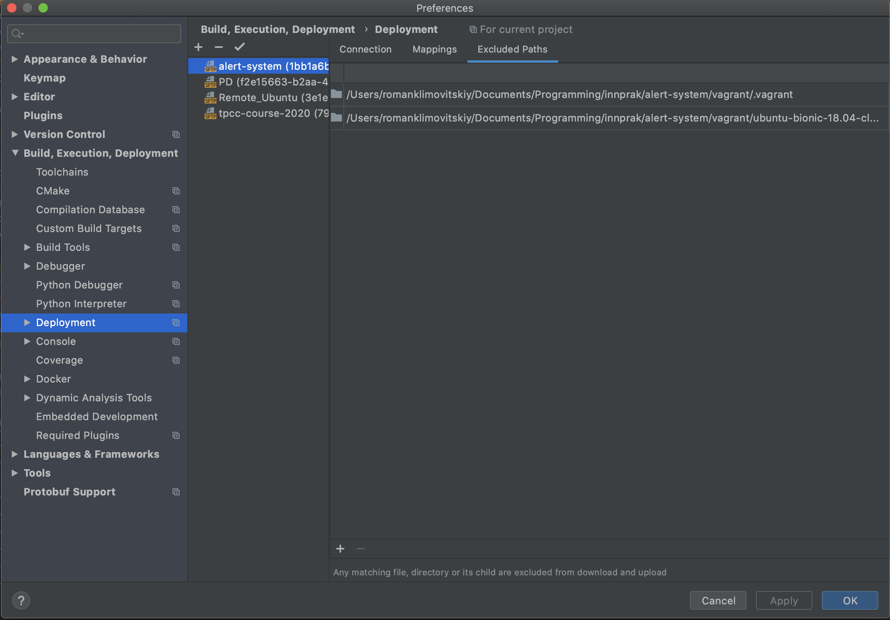

# Настройка окружения разработки

## Создание виртуальной машины

Для создания виртуальной машины со всеми необходимыми инструментами для сборки и разработки достаточно вызвать
`./create.sh`, находясь в этой директории (`vagrant/`). Для успешного исполнения скрипта необходимо установить `vagrant`
и `virtualbox` последних версий. Скрипт добавит и/или обновит базовый образ, использующийся для виртуальной машины -
`ubuntu/bionic64` и вызовет `vagrant up`.

## Работа с vagrant

- `vagrant up` - запускает текущую (в соответствии с текущей директорией) виртуальную машину
- `vagrant halt` - останавливает текущую виртуальную машину
- `vagrant destroy` - уничтожает текущую виртуальную машину
- `vagrant ssh` - подключиться к виртуальной машине по ssh

## Интеграция с CLion

Чтобы настроить Full Remote Mode для работы в CLion, нужно выполнить следующие шаги:

1. Создайте виртуальную машину - `./create.sh`. После инициализации vagrant сообщит порт для работы с виртуальной
машиной по ssh. По умолчанию в конфиге указан порт 22220.

2. Зайдите в CLion, перейдите в настройки *Settings/Preferences | Build, Execution, Deployment | Toolchains*.
    
    - Добавьте новый toolchain, согласно изображению
    - При выборе типа укажите *Remote Host*
    - Выберите аналогичные настройки, в поле *Port* укажите выданный после команды `./create.sh` (по умолчанию - 22220).
    В качестве *private key* нужно указать `/path/to/alert-system/vagrant/.vagrant/machines/default/virtualbox/private_key`,
    где `/path/to/alert-system` - абсолютный путь до директории с проектом в вашей системе. *User name* - vagrant.
    
     <!-- .element height="50%" width="50%" -->

3. После создания toolchain CLion сам найдет пути до необходимых инструментов: make, компиляторы для C и C++, GDB.

     <!-- .element height="50%" width="50%" -->

4. Далее перейдите в настройки *Settings/Preferences | Build, Execution, Deployment | CMake*. Здесь необходимо создать
новый *CMake profile*:

     <!-- .element height="50%" width="50%" -->
    
5. Затем перейдите в *Settings/Preferences | Build, Execution, Deployment | Deployment*.
    - Если конфигурация,
    соотвествующая настройкам ssh из 2 пункта, не появилась автоматически, создайте ее. Далее ее можно переименовать.
    
     <!-- .element height="50%" width="50%" -->
    
    - Затем перейдите во вкладку *Mappings*. Здесь установите *Deployment path* равным `home/vagrant/alert-system` - это
    будет путем до директории с проектом на виртуальной машине (`/home/vagrant` - это домашняя директория).
    
     <!-- .element height="50%" width="50%" -->
    
    - После этого рекомендуется вручную указать файлы и директории, которые нужно исключить из синхронизации между
    директориями: `/path/to/alert-system/vagrant/.vagrant` и
    `/path/to/alert-system/vagrant/ubuntu-bionic-18.04-cloudimg-console.log` - эти файлы создадутся после инициализации
    виртуальной машины и не нужны для сборки. Аналогично, `/path/to/alert-system` - абсолютный путь до директории с
    проектом в вашей системе.
    
     <!-- .element height="50%" width="50%" -->

# Использование Full Remote Mode

Теперь из CLion можно вести разработку как обычно, при этом работая на виртуальной машине. В полной мере доступна
подсветка синтаксиса, автодополнение, сборка, запуск приложениий. При необходимости можно пробросить порты с помощью GUI
VirtualBox или подключиться к машине по ssh.

# Исчточники

- [Статья с официального сайта JetBrains по настройке Full Remote Mode](https://blog.jetbrains.com/clion/2018/09/initial-remote-dev-support-clion/)
- [Инструкция, использованная для подготовки этого гайда](https://github.com/mdklatt/clion-remote)
